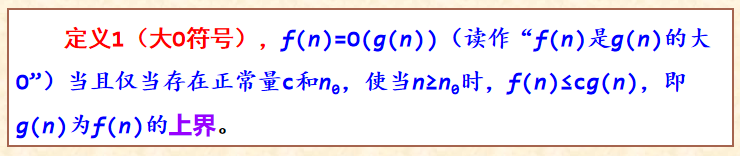

# 算法设计与分析 （考前笔记整理）
---
Author：liulanker@gmail.com  
Date: 2023-11-19  

---
# 目录  
- 第一章：概述
- 第二章：分治法
- 第三章：
- 第四章：
- 第五章：
- 第六章：
---

# 第一章： 概述

## 1.1

1） 算法定义：算法是求解问题的一系列计算步骤，用来将输入数据转换成输出结果 

2） 算法设计应当满足的几个目标：
- 正确性
- 可使用性
- 可读性
- 健壮性
- 高效率与低存储量需求  

3）5种性质
- 有限性
- 确定性
- 可行性
- 输入性
- 输出性

4） 算法与数据结构联系与区别：
- 区别：数据结构是算法设计的基础。算法的操作对象是数据结构，在设计算法时，通常要构建适合这种算法的数据结构。
- 联系：数据结构关注的是数据的逻辑结构、存储结构以及基本操作，而算法更多的是关注如何在数据结构的基础上解决实际问题。

5） 算法设计的基本步骤
- 分析求解问题
- 选择数据结构和算法设计策略
- 描述算法
- 证明算法正确性
- 算法分析  

Author：liulanker@gmail.com 
---
## 1.2
1） 算法分析：算法分析是分析算法占用计算机资源的情况。两个主要方面是分析算法的时间复杂度和空间复杂度。

2） 时间复杂度分析：一个算法是由控制结构（顺序、分支和循环3种）和原操作（指固有数据类型的操作）构成的。

3） 渐进符号（O、Ω和ɵ）  

4） 算法最好最坏情况：

5） 对于非递归算法，分析其时间复杂度相对比较简单，关键是求出代表算法执行时间的表达式。
 
6） 递归算法是采用一种分而治之的方法，把一个“大问题”分解为若干个相似的“小问题”来求解。

7） 一个算法的存储量包括形参所占空间和临时变量所占空间。在对算法进行存储空间分析时，只考察临时变量所占空间。

8） 主定理解时间复杂度：

9） STL
主要由container（容器）、algorithm（算法）和iterator（迭代器）三大部分构成，容器用于存放数据对象（元素），算法用于操作容器中的数据对象。

10） 常用的stl容器 

- 顺序容器 ：vector，string，deque，list
- 适配器容器 ：栈与队列
- 关联容器 ： set/mult/multiset 

Author：liulanker@gmail.com  
---

# 第二章： 分治法

## 2.1  

1） 分治法：对于一个规模为n的问题：若该问题可以容易地解决（比如说规模n较小）则直接解决，否则将其分解为k个规模较小的子问题，这些子问题互相独立且与原问题形式相同，递归地解这些子问题，然后将各子问题的解合并得到原问题的解。

2） 特征：
- 该问题的规模缩小到一定的程度就可以容易地解决。
- 该问题可以分解为若干个规模较小的相同问题。
- 利用该问题分解出的子问题的解可以合并为该问题的解。
- 该问题所分解出的各个子问题是相互独立的，即子问题之间不包含公共的子问题。

3） 步骤：
- 分解：将原问题分解为若干个规模较小，相互独立，与原问题形式相同的子问题。
- 求解子问题：若子问题规模较小而容易被解决则直接求解，否则递归地求解各个子问题。
- 合并：将各个子问题的解合并为原问题的解。 

4） 算法应用

- ### 快速排序
在待排序的n个元素中任取一个元素（通常取第一个元素）作为基准，把该元素放入最终位置后，整个数据序列被基准分割成两个子序列，所有小于基准的元素放置在前子序列中，所有大于基准的元素放置在后子序列中，并把基准排在这两个子序列的中间，这个过程称作划分。然后对两个子序列分别重复上述过程，直至每个子序列内只有一个记录或空为止。

快排分析：

- ###  归并排序
首先将a[0..n-1]看成是n个长度为1的有序表，将相邻的k（k≥2）个有序子表成对归并，得到n/k个长度为k的有序子表；然后再将这些有序子表继续归并，得到n/k2个长度为k2的有序子表，如此反复进行下去，最后得到一个长度为n的有序表。若k=2，即归并在相邻的两个有序子表中进行的，称为二路归并排序。若k>2，即归并操作在相邻的多个有序子表中进行，则叫多路归并排序。

归并分析：

- ### 查找问题
    - 无序数列找最大最小值
    - 折半查找
    - 找有序序列第k小元素
    - 找中位数
    - 最大连续子序列和问题
    - 求解棋盘覆盖问题
    - 求解循环日程安排问题
    - 大数乘法

Author：liulanker@gmail.com  
---